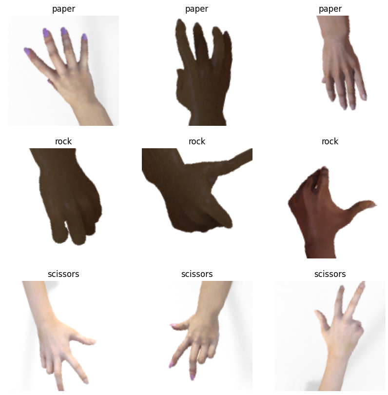
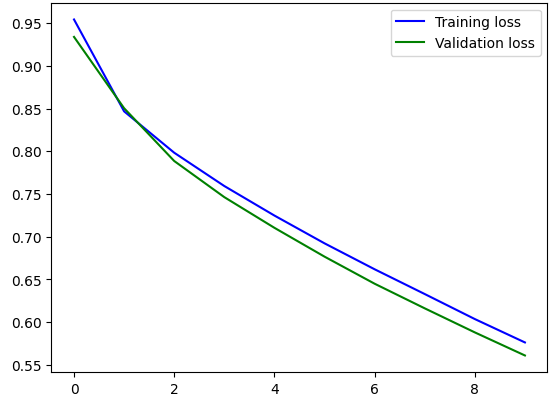

<!-- PROJECT LOGO -->
<br />
<div align="center">
  <a href="https://github.com/ReAlfz/Dataset-Narkotika_160_184">
    
  </a>

<h1 align="center">Rock, Paper, Scissors Prediction</h1>
  <p align="center">
    This project focuses on creating a deep learning model to predict
    images of rock, paper, scissors.
  </p>
</div>

### Authors
- Muhammad Akram Dhaifullah ([@akramdhaifullah](https://www.github.com/akramdhaifullah))

## Dataset
The dataset used in this project contains a total of 2520 images with an equal proportion of images per class: 840 images for rock, paper, and scissors, respectively. [The link to the dataset can be accessed here.](https://drive.google.com/file/d/1X9jFokn9AXMMVTmlBQ7XZpBsLKVFnp-d/view?usp=drive_link)

<div>
    
</div>

### Data Preprocessing
The dataset is first splitted using *splitfolders* library into 3 sets: training, validation, and testing with proportion of 80, 10, and 10 percent respectively.
```python
splitfolders.ratio("Dataset/Images/rps/", output="Dataset/Images/rps_split",
    seed=1337, ratio=(.8, .1, .1), group_prefix=None, move=False)
```
Then, the images are loaded using ImageDataGenerator() from the *keras.preprocessing.image* library. To prevent overfitting, the images are augmented with the paramaters below:
- rotation_range=30
- shear_range=0.2
- zoom_range=0.025
- horizontal_flip=True
- vertical_flip=True
- width_shift_range=0.05
- height_shift_range=0.05
- brightness_range=(1,1.1)

<div>
    
</div>

## Deep Learning Model
The modelling involves training the dataset with a pre-trained MobileNet model. MobileNet is a lightweight convolutional neural network architecture that is trained on the ImageNet dataset consisting of millions of labeled images accross thousands of categories.

<div>
    
</div>

### Model Training
Model is trained on the dataset with RMSprop optimizer and *categorical_crossentropy* loss for 10 epochs.
<div style="display: flex">
    <div style="margin-right: 10px">
        
    </div>
    <div>
        
    </div>
</div>

### Model Evaluation
After the model has been trained, the test dataset is used to evaluate the model.
<div>
    
</div>
Based on the classification report, the model excellently predicted the labels for each images on the test dataset, with 100% overall accuracy.
